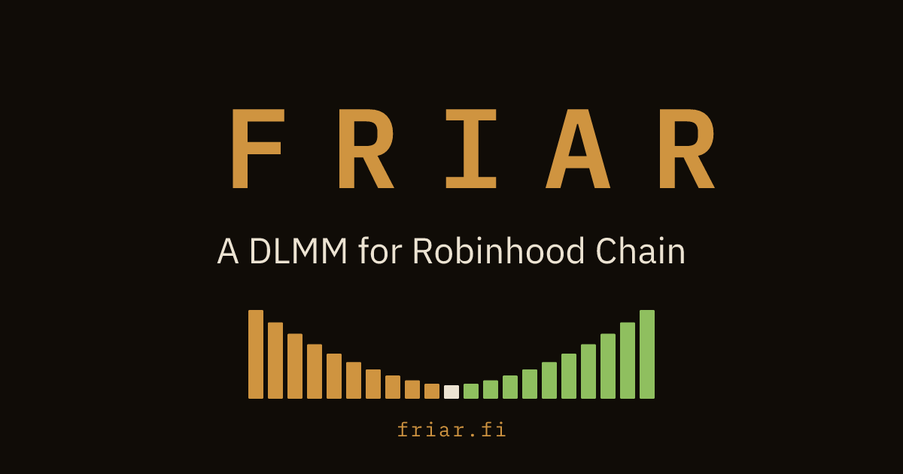
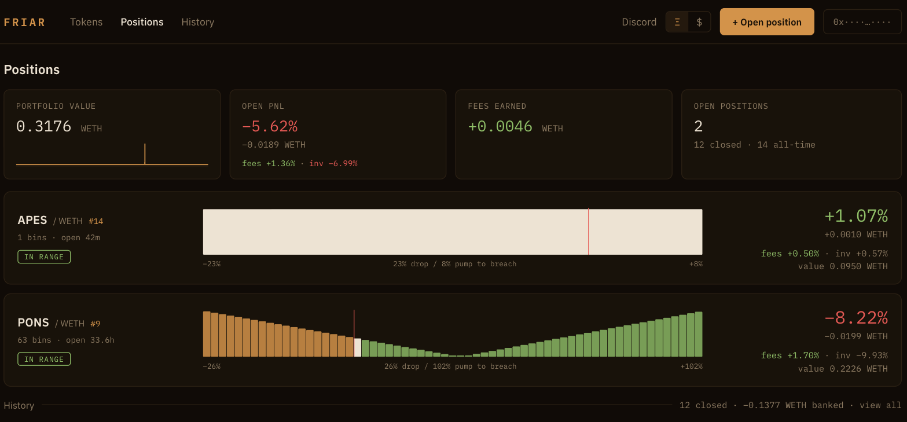

<p align="center">
  <a href="https://app.friar.fi"></a>
</p>

<h1 align="center">friar</h1>

<p align="center">
  A DLMM (dynamic liquidity market maker) and LP position manager for
  <a href="https://robinhood.com/chain">Robinhood Chain</a>, an Arbitrum Orbit L2, chain id <b>4663</b>.
</p>

<p align="center">
  <b><a href="https://app.friar.fi">Live at app.friar.fi</a></b>
  &nbsp;·&nbsp; <a href="https://friar.fi/docs/">Docs</a>
  &nbsp;·&nbsp; <a href="https://www.npmjs.com/package/@josephtaylor/friar-sdk">npm</a>
</p>

---

It shipped, it worked, and approximately nobody used it. Putting the whole thing up
because the code is more useful public than it is sitting on my disk. Contracts through
frontend, all in here. **It is still running**, so you can click around before reading
any of it.

<p align="center">
  <a href="https://app.friar.fi"></a>
</p>

## What it is

- **A Uniswap v4 hook** that ports the Liquidity Book volatility-accumulator dynamic fee
  (the mechanism behind Meteora's DLMM) into v4. The base fee surges with realized
  volatility and decays back toward the floor.
- **`FriarPositionManager`**, which turns "N concentrated-liquidity positions forming a
  shape" into a single NFT you open, manage, and close in one transaction. Shapes are
  `spot` (uniform), `curve` (bell around price), and `bidask` (weighted to the edges).
- **The product layer**: a chain indexer, a REST API, and a React app that lets you think
  in shapes and percent-below-price ranges instead of raw ticks.

Both hooks and all three managers are deployed, source-verified, and immutable. No owner,
no upgrade path, no protocol fee. A position can always be exited directly against its own
manager, knowing nothing but the position id, whether or not any of this is running.

## Layout

```
contracts/            Foundry. The hook, FriarMath, FriarPositionManager, deploy scripts.
packages/core         The math. Tick math, bin decomposition, shapes, PnL/IL accounting.
packages/chain        viem config for 4663: addresses, ABIs, StateView reads, safety.
packages/sdk          The published SDK. Reads, planning, unsigned tx builders.
apps/indexer          Cloudflare Durable Object: eth_getLogs loop into D1, candles, marks.
apps/api              Hono worker, REST reads over D1.
apps/web              React + wagmi. Dashboard and position creation.
apps/site             The marketing site.
apps/mcp              Remote MCP server, exposes the SDK surface to AI agents.
```

## The parts worth reading

- **`packages/core`** is the interesting one. Pure TypeScript, no chain calls, no
  framework, fully tested. If you lift one thing out of this repo, lift this.
  - The load-bearing rule in it: **mark against the real market price, never the pool
    tick.** A pool whose range has been breached has a frozen tick that quietly lies to
    you, and every position you value with it is wrong. Learned the expensive way.
- **`contracts/src/FriarMath.sol`** is the LB volatility accumulator translated into v4
  units, which is the part that took the longest to get right.
- **`apps/indexer`** is a whole chain indexer as one Durable Object on an alarm loop,
  deriving OHLC candles from Swap events and taking periodic position marks, for roughly
  nothing per month.
- **`packages/chain/src/safety.ts`** merges Blockaid (through Uniswap's interface gateway)
  and GoPlus into one block/warn verdict, including a hard block on fee-on-transfer
  tokens, because an exact-amount settle reverts on them.

## SDK

```bash
npm install @josephtaylor/friar-sdk viem
```

Published from `packages/sdk`, with `core` and `chain` bundled in, so it is one install
and `viem` is the only peer. It covers the API reads, chain-direct reads that need nothing
but an RPC, shape planning, unsigned transaction builders, and the bin math itself.

## Running it

Everything off-chain runs locally in Miniflare, so no Cloudflare account is needed. The
only remote dependency is a read-only chain RPC.

```bash
npm install
npm test
npm run typecheck

npm run db:schema           # create tables in the local D1
npm run db:seed             # demo pool, candles, an open position
node scripts/stack.mjs up   # indexer :8790, api :8788, web :5173
```

Contracts, from `contracts/` (dependencies are gitignored, clone them once):

```bash
git clone --depth 1 --recursive --shallow-submodules https://github.com/Uniswap/v4-periphery lib/v4-periphery
git clone --depth 1 https://github.com/foundry-rs/forge-std lib/forge-std
forge test
```

`DEPLOY.md` records how this was actually shipped to Cloudflare. It is a record, not an
invitation.

## License

MIT. Do whatever you want with it.
